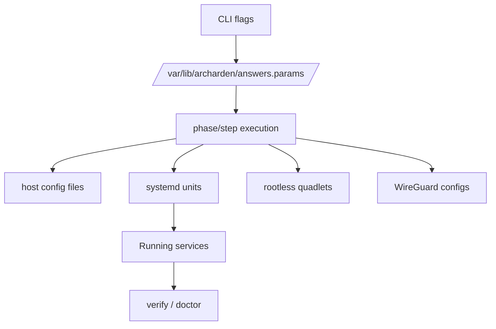

# Data Flow

```mermaid
flowchart TD
    CLI[CLI flags] --> Answers[/var/lib/archarden/answers.params/]
    Answers --> Steps[phase/step execution]
    Steps --> Host[host config files]
    Steps --> Units[systemd units]
    Steps --> Quadlets[rootless quadlets]
    Steps --> WG[WireGuard configs]
    Units --> Services[Running services]
    Services --> Verify[verify / doctor]
```

## Observation

The project has a real data flow, but not yet a formal state graph. That distinction matters when thinking about future evolution.
