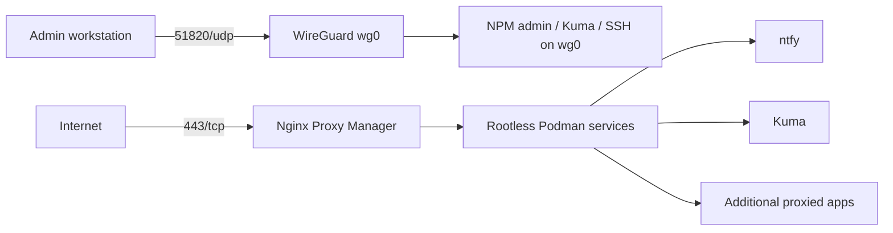

# Archarden

Archarden is a reproducible Arch Linux host bootstrap and hardening project for a narrow but real problem: take a fresh VPS, reduce the public attack surface, move administration behind WireGuard, and stand up a small self-hosted operations stack without turning the host into an undocumented pet.

This project is not presented as the "correct" replacement for Ansible, Terraform, NixOS, or any other mature infrastructure tool. It started as what was supposed to be a short Bash script, then kept growing because the interesting part turned out to be the layers underneath: systemd lifecycle behavior, socket activation, WireGuard routing, Podman rootless networking, resumable execution, and the simple fact that host security is more than installing fail2ban and declaring victory.

That framing matters. Archarden is best read as an intentional deep dive into system behavior, not as a claim that everyone should provision servers this way.

## What it does

- Hardens an Arch Linux VPS with SSH restrictions, firewall policy, journald persistence, fail2ban, sysctl tuning, and `/tmp` hardening.
- Creates a WireGuard admin plane and deliberately keeps admin surfaces off the public internet.
- Deploys Nginx Proxy Manager, ntfy, and Uptime Kuma as rootless Podman services under a dedicated service account.
- Uses phased, reboot-aware execution so required restarts do not leave the system half-configured.
- Includes verification, diagnostics, backups, and notification plumbing.

## Why this exists

Archarden is useful in three ways:

1. **As a working single-node project** with a deliberately small exposed surface.
2. **As a close-to-the-system learning platform** for understanding how Linux layers interact when the happy path runs out.
3. **As a practical reference** for people who want to understand exposure boundaries, service ownership, and operational tradeoffs more clearly.

## Audience

This documentation assumes you are comfortable with Linux administration, shell, systemd, basic networking, and the idea that a server can absolutely lock you out if you get clever too early.

## Read this first

- [Project overview](getting-started/overview.md)
- [Operator flow](operations/operator-flow.md)
- [Security model](architecture/security.md)
- [Design tradeoffs and limitations](architecture/design-tradeoffs.md)
- [Potential future roadmap](architecture/potential-future-roadmap.md)

## Architecture at a glance

## What this project is not

- Not a replacement for Ansible, Terraform, Salt, NixOS, or a real CM/infra platform.
- Not a general-purpose cluster orchestrator.
- Not a formal security benchmark or compliance framework.
- Not a definitive guide to hardening.

It is a concrete, opinionated project with enough surface area to demonstrate systems thinking and enough rough edges to stay honest about what custom infrastructure actually costs.
